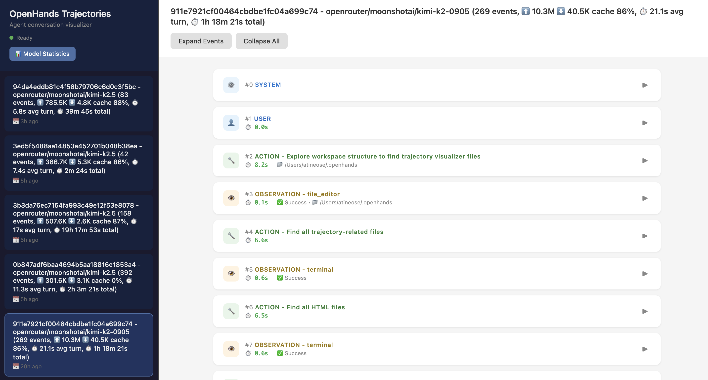
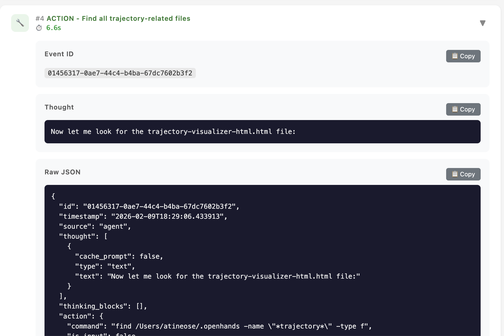
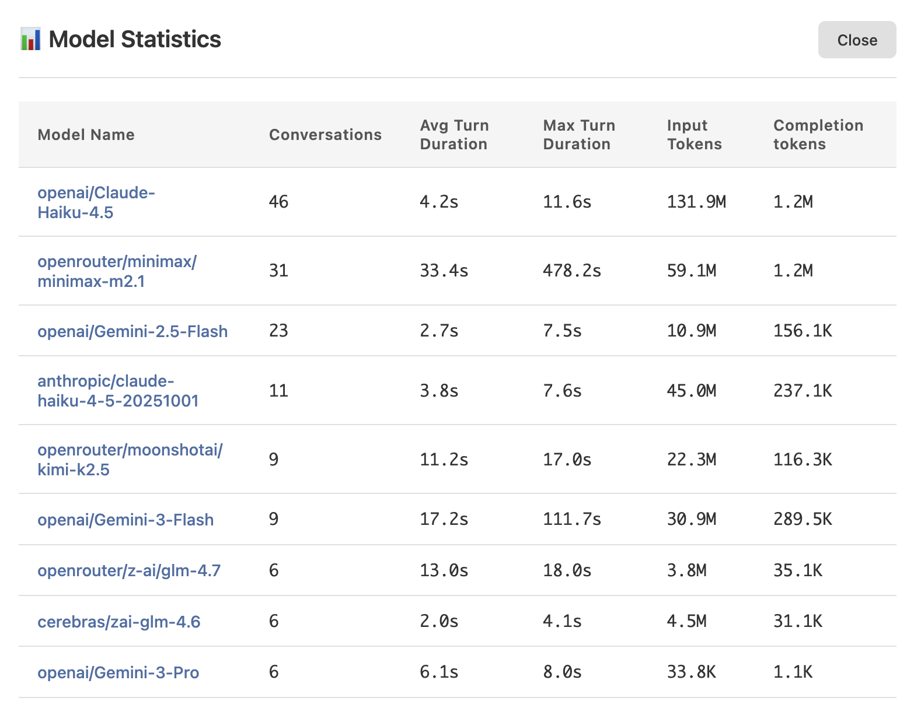

# OpenHands Trajectory Visualizer

A visualizer for OpenHands CLI conversation trajectories. Useful for debugging or simply for inspecting the conversation history.


Event list: get all events for every agent conversation


Action detail: inspect action details, blending or unblending as needed


Model stats: inspect token usage and average turn time per model

Try the example [here](https://adriantineo.com/openhands-trajectory-visualizer/).

## Setup

1. Clone this repo
2. Install dependencies: `npm install`
3. Run `./rebuild` to generate data from all conversations in `~/.openhands/conversations`. Alternatively, provide a custom folder with `./rebuild my_custom_path`
4. Serve with `./serve`
5. Visualize in your browser from `localhost:8050`

## Development

```bash
# Install dependencies
npm install

# Run development server
npm run dev

# Build for production
npm run build

# Run ESLint
npm run lint
```

## Features

- Light/Dark mode toggle
- Trajectory list with search and filtering
- Event timeline with expand/collapse
- Model statistics dashboard
- Responsive design with shadcn/ui components